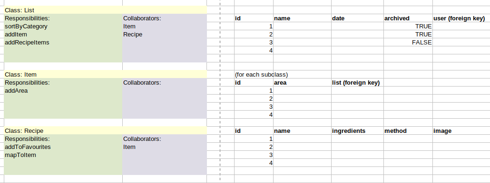
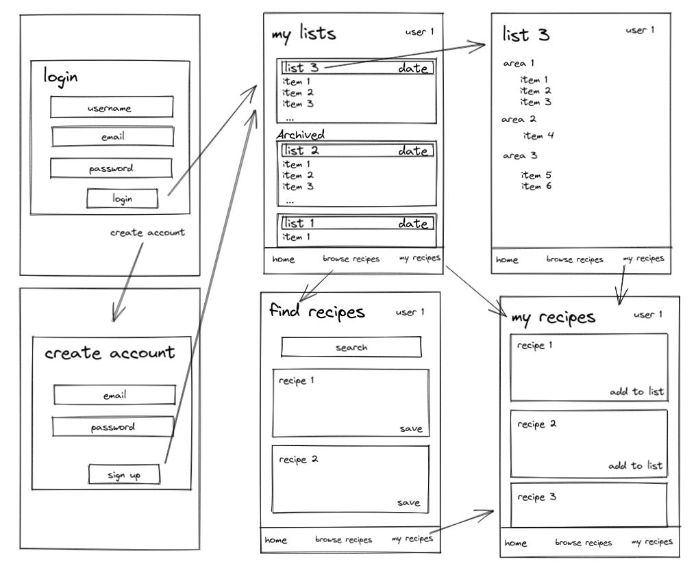

## scramble

This mobile app allows searching and saving of recipes, as well as creation of a shopping lists. This is inspired by covid and my onw desire to cook new and more varied vegan recipes more easily.

#### Try
First install expo-cli: ``npm install --global expo-cli``

Run the frontend:
```
cd frontend
npm i
npx expo start
```
The app uses MongoDB Atlas, so first intall MongoDB and start an instance ``sudo service mongod start``

npm dotenv is used to hide IP address needed for React to communicate with Express. Create a .env file in the root of the frontend folder with your ipv4 ``IP_ADDRESS=""``

The recipe search and save function requires an Edamam account (https://www.edamam.com/). Save your Edamam app ID and key in the .env file as ``APP_ID=""`` and ``APP_KEY=""``

Run the backend
```
cd app
npm i
npm start
```
<p align="center">

</p>

#### Aproach



